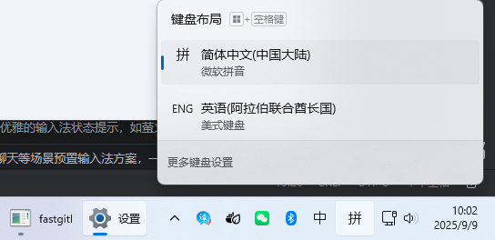

<!-- Plugin description -->
# 🔑 key-switch —— 智能输入法自动切换工具

根据光标前的字符类型，自动切换中英文输入状态，让您的输入体验如行云流水般顺畅！

## 🚀 核心功能
智能感知光标前的字符特征，精准触发输入法切换，告别手动切换的繁琐操作。
## ⚠️ 注意事项
暂时只支持windows，不支持mac、linux

## 📅 更新计划
### ✅ 已完成
1. **可视化切换方式配置**  
   提供清爽直观的界面，自由选择最适合您的输入法切换方案

2. **多模式切换引擎**

- `UI自动化模式（默认配置）`：
  - [x] 通过UIAutomation查找输入法按钮模拟点击切换输入法（性能稍慢约4ms）  
  
  - [x] 实现静默点击，不会切换焦点窗口，不会触发windows按钮悬停事件  
  - [x] 支持windows11  
  - [ ] *待测试：Windows 10环境兼容性验证*

- `模拟快捷键模式`：  
  - [x] 通过模拟Shift键切换（兼容性最佳，性能最佳）  
      ⚠️ *存在极短暂（约1ms）的按键模拟，可能引发微小干扰*  
      ⌨️ *待开发：定向窗口句柄发送按键消息（避免全局触发）*

- `截图定位点击`：
  - [ ] 使用截图定位按钮点击按键切换输入法（未实现但看起来性能比UIAutomation还会更差）

- `使用windows接口进行切换`：
  - [x] ~~IMM接口：微软已停止支持，win11无效，并且无法在同一个输入法内切换中英文模式，只支持布局切换~~
  - [x] ~~TSF接口：直接切换中英文win11+微软拼音无效，可能因为各输入法内部实现不同，并且无法在同一个输入法内切换中英文模式，只支持布局切换~~
    - 💡 PS:布局切换如下图，需要先在系统中添加另一种语言，为该语言添加键盘。等于直接切换输入法，例如从微软拼音切换为智能ABC。会失去常用输入法的提供的词库候选等功能。
    - 
### 🚧 开发中
- `智能语境识别`：
  基于语义场景自动切换中英文，让输入法拥有「读心术」
- `切换状态视觉反馈`：
  在光标处显示优雅的输入法状态提示，如萤火微光般轻柔提醒
- `场景化预设配置`：
  为注释/代码编辑区/git commit等场景预置输入法方案，让输入法更得心应手，完全告别Shift
- `智能习惯学习`：
  记忆用户在特定位置的手动切换行为，逐步进化成懂您的输入伴侣
<!-- Plugin description end -->